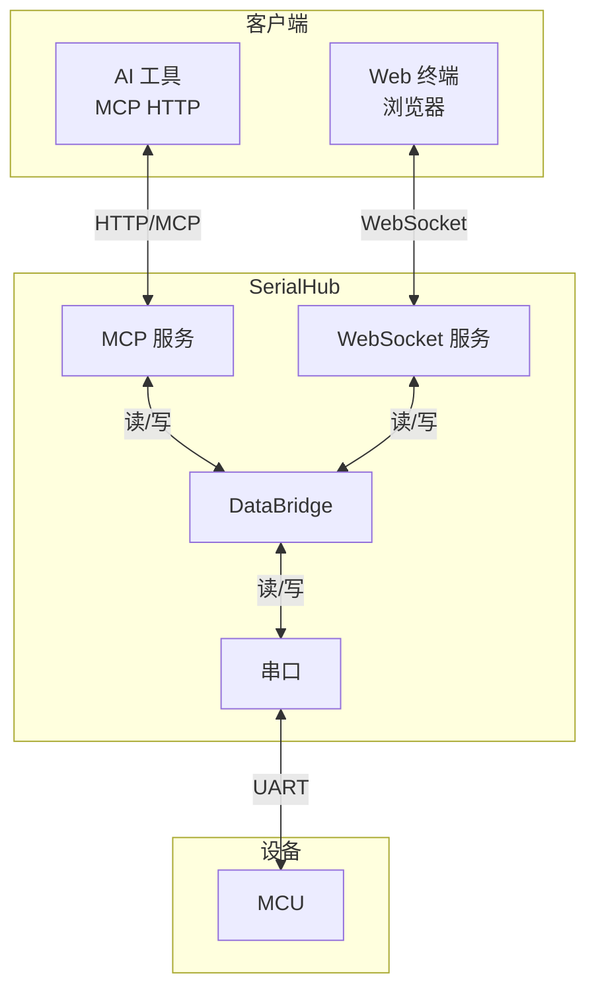

# SerialHub - AI 代理指南

## 项目概述

SerialHub 是串口（MCU）与网络连接（Web 终端/AI）的双向桥接器。



## 快速启动

**编译后使用 `start.ps1` 启动**（推荐）：

```powershell
.\start.ps1 -p COM7          # 连接 COM7
.\start.ps1 -p COM7 -D       # 调试模式
```

脚本会自动终止旧进程、启动最小化窗口、输出日志路径。

**日志位置**: `bin\logs\serialhub.log`

## MCP 调用

```python
import requests

def mcp_call(tool_name, arguments=None):
    resp = requests.post(
        "http://127.0.0.1:5000/mcp",
        headers={"Content-Type": "application/json"},
        json={
            "jsonrpc": "2.0",
            "method": "tools/call",
            "params": {"name": tool_name, "arguments": arguments or {}},
            "id": 1
        },
        timeout=10
    )
    return resp.json()

# 标准流程
mcp_call("serial_list")                                    # 1. 查找串口
mcp_call("serial_connect", {"port": "COM7"})              # 2. 连接
mcp_call("serial_write", {"data": "help"})                # 3. 发送命令
result = mcp_call("serial_read", {"timeout": 3000})       # 4. 读取响应
mcp_call("serial_disconnect")                             # 5. 断开
```

**工具列表**: `serial_list`, `serial_status`, `serial_connect`, `serial_disconnect`, `serial_write`, `serial_read`

**Web 终端**: `http://127.0.0.1:5000/terminal`

## 构建 / 测试

```powershell
# 构建
go build -o bin/serialhub.exe ./cmd/serialhub

# 测试
go test ./...
$env:SERIALHUB_HARDWARE_TEST=1; $env:SERIALHUB_TEST_PORT="COM9"; go test ./...  # 硬件测试

# 检查
go vet ./...
go mod tidy
```

## 文件结构

```
cmd/serialhub/main.go           # CLI 入口
pkg/serial/                     # 串口管理
pkg/web/                        # Web 终端（WebSocket + xterm.js）
pkg/web/static/                 # 前端静态文件
pkg/mcp/                        # MCP 服务
pkg/bridge/                     # 数据桥接
pkg/config/                     # TOML 配置
pkg/version/                    # 版本信息
internal/buffer/                # 数据缓冲区
internal/service/               # 服务管理
internal/testutil/              # 测试工具
tests/e2e/                      # 端到端测试
start.ps1                       # 启动脚本
```

## 代码风格

**导入顺序**: 标准库 → 第三方库 → 本地模块

**错误处理**:
- 用户错误消息用**中文**
- MCP 工具返回 `ToolResult{Success, Message, Data}`
- 错误包装：`fmt.Errorf("连接失败：%w", err)`

**测试**: 描述用中文，如 `func TestXxxx(t *testing.T)`

## Git 提交

格式：`<type>(<scope>): <subject>`

Type: `feat`, `fix`, `refactor`, `test`, `docs`, `chore`

Scope: `serial`, `web`, `mcp`, `tray`, `cli`, `bridge`, `config`, `buffer`

示例:
```bash
git commit -m "feat(tray): 添加串口自动重连功能"
git commit -m "fix(serial): 修复断开连接后端口未释放的问题"
```

## 开发流程

```
开发 → go vet → go build → go test → review → commit
```

**Powershell 注意**: 运行 git 命令前**不能**用 `export`
