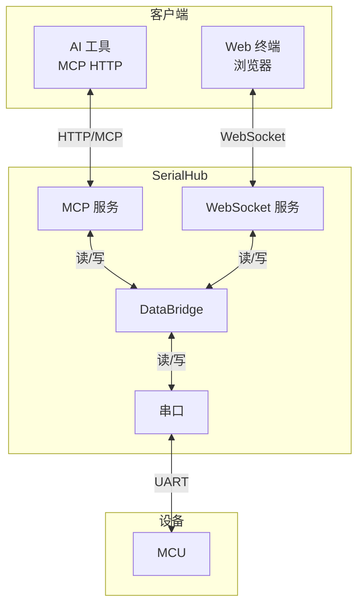

# SerialHub - AI 代理指南

## 项目概述

SerialHub 是串口（MCU）与网络连接（Web终端/AI）的双向桥接器，Go 语言实现。



## MCP (Model Context Protocol) 快速参考

SerialHub 通过 MCP HTTP 接口提供串口操作能力，AI 工具可直接调用。

### 端点

| 服务 | URL | 方法 |
|------|-----|------|
| 健康检查 | `http://127.0.0.1:5000/health` | GET |
| MCP 服务 | `http://127.0.0.1:5000/mcp` | POST |

### 可用工具

| 工具名 | 功能 | 必需参数 |
|--------|------|----------|
| `serial_list` | 列出可用串口 | 无 |
| `serial_status` | 获取连接状态 | 无 |
| `serial_connect` | 连接串口 | `port` |
| `serial_disconnect` | 断开连接 | 无 |
| `serial_write` | 写入数据 | `data` |
| `serial_read` | 读取数据 | 无 |

### 调用示例 (Python)

```python
import requests

def mcp_call(port, tool_name, arguments=None):
    """调用 MCP 工具"""
    resp = requests.post(
        f"http://127.0.0.1:{port}/mcp",
        headers={"Content-Type": "application/json"},
        json={
            "jsonrpc": "2.0",
            "method": "tools/call",
            "params": {"name": tool_name, "arguments": arguments or {}},
            "id": 1
        },
        timeout=10
    )
    return resp.json()

# 标准工作流程
mcp_call(5000, "serial_list")                                    # 1. 查找串口
mcp_call(5000, "serial_connect", {"port": "COM4"})              # 2. 连接
mcp_call(5000, "serial_write", {"data": "version"})             # 3. 发送命令
result = mcp_call(5000, "serial_read", {"timeout": 3000})       # 4. 读取响应
print(result["result"]["content"][0]["text"])
mcp_call(5000, "serial_disconnect")                             # 5. 断开连接
```

### OpenCode MCP 配置

OpenCode 支持两种配置级别，**项目级 > 用户级**。

| 级别 | 配置文件路径 | 适用场景 |
|------|-------------|---------|
| 用户级 | `~/.opencode/opencode.json` | 个人开发，全局共用 |
| 项目级 | `opencode.json`（项目根目录） | 团队协作，独立配置 |

```json
{
  "mcp": {
    "serialhub": {
      "type": "remote",
      "url": "http://127.0.0.1:5000/mcp",
      "enabled": true
    }
  }
}
```

### 完整文档
详见项目根目录 [`MCP.md`](./MCP.md) 文件。

## 技术栈

Go 1.26+ | go.bug.st/serial | modelcontextprotocol/go-sdk | WebSocket/xterm.js | spf13/cobra | BurntSushi/toml | getlantern/systray | sirupsen/logrus

## 构建 / 测试命令

> **注意**: 当前开发环境为 Windows PowerShell。Bash 命令需使用 Git Bash 或 WSL。

```powershell
# 开发
go run ./cmd/serialhub              # 启动服务（默认开启托盘）
go run ./cmd/serialhub --no-tray    # 无托盘模式

# 构建
go build -o bin/serialhub.exe ./cmd/serialhub

# 测试
go test ./...                       # 所有测试
go test ./pkg/serial                # 单个包
go test -run TestConnect ./pkg/serial  # 单个测试函数
go test -cover ./...                # 覆盖率
$env:SERIALHUB_HARDWARE_TEST=1; $env:SERIALHUB_TEST_PORT="COM9"; go test ./...  # 硬件测试

# 检查
go vet ./...                        # 静态分析（零错误）
go mod tidy                         # 整理依赖
```

## 文件结构

```
cmd/serialhub/main.go           # CLI 主入口
pkg/serial/                     # 串口管理（manager.go, config.go）
pkg/web/                        # Web 终端服务（WebSocket + xterm.js）
pkg/mcp/server.go               # MCP 服务（StreamableHTTP，Stateless JSON 模式）
pkg/mcp/tools/                  # MCP 工具（serial_list/connect/disconnect/write/read/status）
pkg/bridge/                     # 数据桥接（bridge.go, events.go）
pkg/config/config.go            # TOML 配置（BurntSushi/toml）
pkg/tray/                       # 系统托盘（tray.go, assets/, console_*.go）
internal/buffer/                # 数据缓冲区（buffer.go）
internal/service/               # 服务管理（manager.go, singleton_*.go, lock_*.go）
internal/testutil/              # 测试工具（helpers.go, mock_serial.go, mock_net.go）
tests/e2e/                      # 端到端硬件测试
tools/genicons.py               # 托盘图标生成（Python + PIL）
```

## 代码风格

### 导入顺序
```go
// 1. 标准库  2. 第三方库  3. 本地模块
import (
    "context"
    "fmt"
    "go.bug.st/serial"
    "github.com/spf13/cobra"
    "github.com/yourname/serialhub/pkg/config"
)
```

### 命名规范

| 元素 | 规范 | 示例 |
|------|------|------|
| 包名/常量/私有字段 | lowercase/camelCase | `serial`, `maxBufferSize`, `port` |
| 结构体/接口/公有方法 | PascalCase + `er` 后缀 | `SerialManager`, `Connector` |
| Channel | camelCase + `Chan` | `dataChan`, `errChan` |
| MCP 工具函数 | `Execute` 前缀 | `ExecuteSerialConnect()` |

### 错误处理
- 用户错误消息用**中文**：`return fmt.Errorf("串口未连接")`
- MCP 工具返回 `ToolResult{Success, Message, Data}` 结构
- 错误包装：`fmt.Errorf("连接失败: %w", err)`
- 非关键操作静默处理：`defer port.Close()`

### 其他约定
- 构造函数返回 error：`func NewXxx(cfg) (*Xxx, error)`
- Getter 命名：`GetConfig()` 返回副本，`IsConnected()` 返回 bool
- 日志前缀：`logrus` + `[SerialHub]`
- 清理方法：`Close()` 或 `Stop()`
- Channel 初始化：`make(chan []byte, bufferSize)`
- 测试描述用中文：`func TestXxxx(t *testing.T)`

## 架构原则

1. **关注点分离**：串口、Web 终端、MCP 各自独立包
2. **Channel 模式**：模块通过 channel 通信
3. **错误恢复力**：任一模块故障不影响其他模块
4. **MCP 工具模式**：每个工具定义 Input struct + Execute 函数 + ToolResult
5. **Context 传递**：所有阻塞操作接收 `context.Context`

## Git 提交规范

### 格式
```
<type>(<scope>): <subject>

<body>
```

### Type

| 类型 | 说明 |
|------|------|
| `feat` | 新功能 |
| `fix` | Bug 修复 |
| `refactor` | 重构 |
| `test` | 测试 |
| `docs` | 文档 |
| `chore` | 构建/工具/依赖 |

### Scope

`serial`, `web`, `mcp`, `tray`, `cli`, `bridge`, `config`, `buffer`

### 原则

1. **原子提交**：每个 commit 只做一件事
2. **频繁提交**：完成小功能就提交
3. **中文描述**：subject 和 body 用中文

### 示例
```bash
git commit -m "feat(tray): 添加串口自动重连功能"
git commit -m "fix(serial): 修复断开连接后端口未释放的问题"
```

## 开发流程

```
开发 → go vet → go build → go test → review → commit
```

- `go vet ./...` — 零错误
- `go build ./...` — 编译成功
- `go test ./...` — 测试通过
- **review** — 自查代码（见下方清单）
- `git commit` — 遵循提交规范
- 运行 git 命令前 **不能** 用 `export` (powershell 不支持)

### Review 自查清单

- [ ] 无 `fmt.Println` 调试代码残留
- [ ] 无注释掉的死代码
- [ ] 导入顺序正确（标准库 → 第三方 → 本地）
- [ ] 错误消息使用中文
- [ ] 公有方法有文档注释
- [ ] 新功能有对应测试