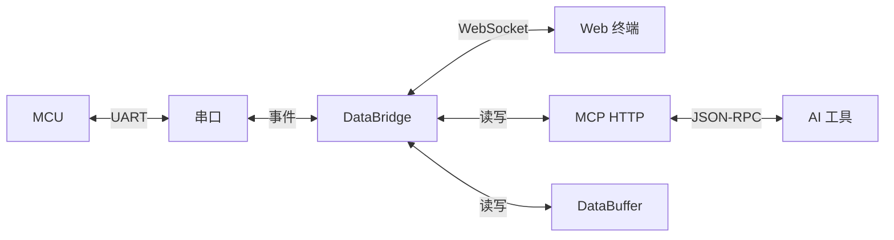

# SerialHub - AI 代理指南

串口（MCU）与网络（Web 终端/AI MCP）的双向桥接器。核心是 DataBridge 事件总线，串口数据同时转发到 WebSocket 和 MCP HTTP。



## 命令

```powershell
# 构建
go build -o bin/serialhub.exe ./cmd/serialhub   # 直接构建
make build                                      # Makefile 用 -ldflags "-s -w"（剥离符号表）

# 检查 + 测试
go vet ./... && go test ./...

# 单个包测试
go test ./pkg/serial/...
go test ./pkg/bridge/ -run TestDataBridge_StartStop

# 硬件测试（需真实串口，默认跳过）
$env:SERIALHUB_HARDWARE_TEST="1"; $env:SERIALHUB_TEST_PORT="COM9"; go test ./...

# 启动（推荐用脚本）
.\start.ps1 -p COM7 -D       # 自动杀旧进程、最小化窗口、输出日志路径
serialhub -p COM7 -D         # 直接启动
```

日志：`bin\logs\serialhub.log` | Web 终端：`http://127.0.0.1:5000/terminal` | 健康检查：`http://127.0.0.1:5000/health`

## 测试

- **Go 单元测试**：`go test ./...`（`internal/testutil/` 提供 mock 串口和网络连接）
- **Python 集成测试**：`tests/integration/`（需 pytest + 运行中的 SerialHub 服务）
- **Python E2E 测试**：`tests/e2e/`（Playwright，需真实串口设备）
- 硬件测试由 `SERIALHUB_HARDWARE_TEST=1` 控制，`SERIALHUB_TEST_PORT` 指定端口

## 架构要点

**启动流程** (`cmd/serialhub/serve.go`)：
1. `service.EnsureSingleInstance()` — 单实例锁（`%TEMP%\serialhub.pid`）
2. `loadConfig()` — CLI 参数 > 配置文件 > 默认值
3. 创建 `SerialManager` → `DataBuffer` → 根据 Windows/非Windows 走托盘或命令行模式
4. `startServices()` — 创建 `DataBridge` + `MCPServer`，共享 `SerialManager` 和 `DataBuffer`

**DataBridge** (`pkg/bridge/`)：核心事件总线，启动两个 goroutine：
- 串口 → Telnet/WebSocket + MCP（串口数据同时广播到所有客户端）
- Telnet/WebSocket → 串口（客户端输入转发到串口）
- 通过 `SetCommandHandler` 支持外部命令拦截

**MCP 服务** (`pkg/mcp/`)：StreamableHTTP 模式，端口与 WebSocket 共用（默认 5000）
- 工具定义在 `pkg/mcp/tools/` 下，每个工具一个文件
- 所有工具返回 `ToolResult{Success, Message, Data}`（定义在 `pkg/mcp/tools/serial_list.go`）
- MCP 服务与 WebSocket 共享同一个 `DataBuffer`，`serial_read` 从缓冲区读取

**DataBuffer** (`internal/buffer/`)：线程安全环形缓冲区，默认 64KB，溢出时丢弃旧数据。
MCP `serial_read` 和 WebSocket 终端共享此缓冲区，避免数据竞争。

**单实例锁** (`internal/service/`)：基于文件锁 `serialhub.pid`，状态文件 `serialhub_status.json` 在 `%TEMP%`。

## CLI 参数

| 参数 | 简写 | 默认值 | 说明 |
|------|------|--------|------|
| `--serial-port` | `-p` | `""` | 串口名（COM9 或 /dev/ttyUSB0），空则不自动连接 |
| `--baud-rate` | `-b` | 115200 | 波特率 |
| `--mcp-port` | `-m` | 5000 | HTTP 服务端口（MCP + WebSocket + Web 终端共用） |
| `--host` | — | 127.0.0.1 | 监听地址 |
| `--config` | `-c` | — | TOML 配置文件路径 |
| `--debug` | `-D` | false | 调试模式 |
| `--minimized` | — | false | 由 `start.ps1` 传入，启动时隐藏控制台 |

配置文件格式见 `config.example.toml`。

## 代码风格

- **错误消息用中文**（用户可见的）：“连接失败：端口不存在”
- 错误包装：`fmt.Errorf("描述：%w", err)`
- 导入顺序：标准库 → 第三方 → 本地（`github.com/yourname/serialhub`）
- 测试描述中文：`func TestXxxx(t *testing.T)`
- 日志前缀统一 `[SerialHub]`

## Git 提交

`<type>(<scope>): <subject>`

Type: `feat`, `fix`, `refactor`, `test`, `docs`, `chore`
Scope: `serial`, `web`, `mcp`, `tray`, `cli`, `bridge`, `config`, `buffer`

## 项目结构

```
cmd/serialhub/         CLI 入口（cobra）、serve 启动、配置加载、日志初始化
pkg/serial/            串口管理（go.bug.st/serial）、事件系统、读写循环
pkg/bridge/            DataBridge 事件总线（核心，双向数据转发）
pkg/mcp/               MCP StreamableHTTP 服务、工具注册
pkg/mcp/tools/         MCP 工具实现（每工具一文件：serial_list/connect/write/read/disconnect/status）
pkg/web/               WebSocket 服务、xterm.js 终端（前端在 static/，embed 编译）
pkg/tray/              Windows 系统托盘（菜单、图标状态、配置同步、自动重连）
pkg/config/            TOML 配置（viper）、CLI 参数合并
pkg/version/           版本信息（构建时 ldflags 注入）
internal/buffer/       DataBuffer 线程安全缓冲区（MCP 与 WebSocket 共享）
internal/service/      单实例锁、状态文件管理
internal/testutil/     Mock 串口（MockSerialPort）、Mock 网络连接（MockConn）、测试辅助
tests/integration/     Python 集成测试（pytest，需运行中的服务）
tests/e2e/             Python E2E 测试（Playwright，需真实串口）
```

## MCP 工具

| 工具 | 文件 | 说明 |
|------|------|------|
| `serial_list` | `serial_list.go` | 列出可用串口（无参数） |
| `serial_connect` | `serial_connect.go` | 连接串口（`port` 必填，`baudRate?`） |
| `serial_disconnect` | `serial_disconnect.go` | 断开连接 |
| `serial_write` | `serial_write.go` | 发送数据（`data` 必填，`addNewline?` 默认 true，自动追加换行符） |
| `serial_read` | `serial_read.go` | 从缓冲区读取（`timeout?` 默认 1000ms，0=无限等待，`maxSize?` 默认 4096） |
| `serial_clear` | `serial_clear.go` | 清空 read 缓冲区（丢弃未读取数据） |
| `serial_status` | `serial_status.go` | 查询连接状态 |

## 前端

Web 终端在 `pkg/web/static/`，通过 Go `embed` 编译进二进制。使用 xterm.js + WebSocket。
- 入口 HTML：`pkg/web/static/index.html`
- 终端页面：`/terminal`，由 `pkg/web/server.go` 的路由提供
- WebSocket 数据流：串口数据通过 `Broadcast()` 推送到所有连接的浏览器客户端
