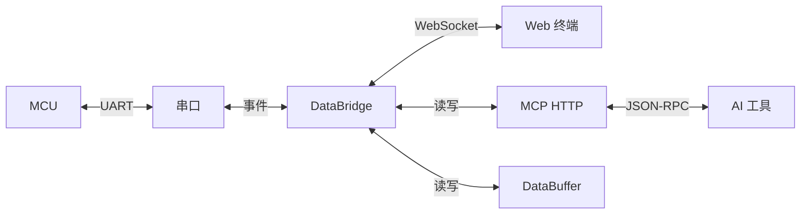

# SerialHub - AI 代理指南

串口（MCU）与网络（Web 终端/AI MCP）的双向桥接器。核心是 DataBridge 事件总线，串口数据同时转发到 WebSocket 和 MCP HTTP。


```mermaid
flowchart LR
    MCU["MCU"] <-->|UART| Serial["串口"]
    Serial <-->|事件| Bridge["DataBridge"]
    Bridge <-->|WebSocket| Web["Web 终端"]
    Bridge <-->|读写| MCP["MCP HTTP"]
    Bridge <-->|读写| Buffer["DataBuffer"]
    MCP <-->|JSON-RPC| AI["AI 工具"]
```

## 命令

```powershell
# 构建
go build -o bin/serialhub.exe ./cmd/serialhub   # 直接构建
make build                                      # Makefile 用 -ldflags "-s -w"（剥离符号表）

# 检查 + 测试
go vet ./... && go test ./...

# 单个包测试
go test ./pkg/serial/...
go test ./pkg/bridge/ -run TestDataBridge_StartStop

# 硬件测试（需真实串口，默认跳过）
$env:SERIALHUB_HARDWARE_TEST="1"; $env:SERIALHUB_TEST_PORT="COM9"; go test ./...

# 启动（推荐用脚本）
.\sr.ps1 -p COM7 -D     # 自动杀旧进程、最小化窗口、输出日志路径
serialhub -p COM7 -D         # 直接启动
```

默认日志：Linux/macOS 用户配置目录下 `serialhub/logs/serialhub.log`（通常为 `~/.config/serialhub/logs/serialhub.log`）；Windows exe 同目录 `logs\serialhub.log`（仓库构建通常为 `bin\logs\serialhub.log`） | Web 终端：`http://127.0.0.1:5050/terminal` | 健康检查：`http://127.0.0.1:5050/health`

## 测试

- **Go 单元测试**：`go test ./...`（`internal/testutil/` 提供 mock 串口和网络连接）
- **Windows 测试（WSL 经 PowerShell）**：`tools/test-windows.sh [包...] [-run 正则]`——交叉编译 Windows 测试二进制并经真实 Windows pwsh 实跑（默认 `./pkg/tray`、zh+en 双语；`SERIALHUB_LANG` 指定单语言；`-hw [TEST:PEER]` 走 com0com 硬件回环——省略值自动探测串口对并自动起对端回显进程，默认包 `./pkg/serial`）。勿在 WSL 内直接 `GOOS=windows go test`（Wine 拉起 systray panic）
- **编译产物端到端测试**：`tests/test-deployed.sh [windows|linux|all]`（默认 all）——windows 场景：WSL 交叉编译 Windows exe，经 interop 在沙箱用户目录（USERPROFILE/LOCALAPPDATA/APPDATA 重定向）实跑 uninstall/upgrade，mock GitHub API（`SERIALHUB_GITHUB_API` 指向 WSL IP）+ 伪造 release 验证升级全链路；linux 场景：ELF 产物同链路（探活拦截验证同侧 local 拒绝——本机 5050 无实例时自动起临时实例再验证，dry-run/uninstall 经 `unshare -rn` 网络隔离避免真实实例干扰）；覆盖 dry-run 清单/延迟自删/随包清理/空目录回收/MCP 条目合并逆操作/弯引号路径；所有命令带 timeout + 全局看门狗挂死自动退出；不在 WSL 时提示无法测试 Windows 产物（windows 模式退出、all 自动降级仅 linux）
- **Python 集成测试**：`tests/integration/`（需 pytest + 运行中的 SerialHub 服务）
- **Python 浏览器 UI 测试**：`tests/integration/playwright/`（pytest + Playwright）
- 硬件测试由 `SERIALHUB_HARDWARE_TEST=1` 控制，`SERIALHUB_TEST_PORT` 指定端口

## 架构要点

**启动流程** (`cmd/serialhub/serve.go`)：
1. `loadConfig()` — CLI 参数 > 配置文件 > 默认值
2. `--stdio` 走 stdio 模式：`instance.Read()` 读 lock 发现活主——有活主则 `RunStdioProxy` 透明代理，无主自成主实例（也持 lock）
3. 主实例：`instance.Acquire()` 获取单实例 OS 文件锁（已被占用则转 stdio 透明代理，与 `--stdio` 发现行为一致）→ 创建 `SerialManager` → `DataBuffer` → Windows 托盘或前台模式，`startServices()` 建 `DataBridge` + `MCPServer`；退出时 `Release()` 关闭句柄释放锁

**DataBridge** (`pkg/bridge/`)：核心事件总线，启动两个 goroutine：
- 串口 → Telnet/WebSocket + MCP（串口数据同时广播到所有客户端）
- Telnet/WebSocket → 串口（客户端输入转发到串口）
- 通过 `SetCommandHandler` 支持外部命令拦截

**MCP 服务** (`pkg/mcp/`)：Streamable HTTP 传输（非流式 JSON 响应模式），端口与 WebSocket 共用（默认 5050）
- 工具定义在 `pkg/mcp/tools/` 下，每个工具一个文件
- 所有工具返回 `ToolResult{Success, Message, Data}`（定义在 `pkg/mcp/tools/serial_list.go`）
- MCP 服务与 WebSocket 共享同一个 `DataBuffer`，`serial_read` 从缓冲区读取

**DataBuffer** (`internal/buffer/`)：线程安全环形缓冲区，默认 64KB，溢出时丢弃旧数据。
MCP `serial_read` 和 WebSocket 终端共享此缓冲区，避免数据竞争。

**单实例 lock** (`internal/instance/`)：`instance.lock`（Linux XDG 用户目录 / Windows 固定 `%LOCALAPPDATA%\serialhub\`，与 exe 位置无关）；OS 锁判定所有权，JSON 记录 pid/port/host 供发现，文件常驻，进程退出释放锁；`IsWSL`/`LocalSide`/`SideDetail` 提供 side 标识（系统侧 + 发行版/主机名细粒度）。

## CLI 参数

| 参数 | 简写 | 默认值 | 说明 |
|------|------|--------|------|
| `--serial-port` | `-p` | `""` | 串口名（COM9 或 /dev/ttyUSB0），空则不自动连接 |
| `--baud-rate` | `-b` | 115200 | 波特率 |
| `--mcp-port` | `-m` | 5050 | HTTP 服务端口（MCP + WebSocket + Web 终端共用；被占时自动 +1 最多试 10 个） |
| `--host` | — | 127.0.0.1 | 监听地址 |
| `--config` | `-c` | — | TOML 配置文件路径 |
| `--debug` | `-D` | false | 调试模式 |
| `--log-data` | — | false | 输出数据内容日志（500ms 时间窗聚合、单条展示截断 512 字节；也可用 SERIALHUB_LOG_DATA=1，显式 `--log-data=false` 优先；两者不回写配置文件） |
| `--stdio` | — | false | stdio 模式：MCP 客户端本地拉起（发现主实例则透明代理） |
| `--minimized` | — | false | 脚本静默启动：窗口最小化（跨平台；Windows 下同时隐藏控制台）。浏览器仍默认自动打开（WSL 下经 Windows 宿主浏览器） |
| `--no-browser` | — | false | 跳过自动打开浏览器（日志仍会提示 Web 终端地址） |

### `serialhub setup`

为 MCP 客户端自动配置接入（交互向导，或 `--client/--mode/--scope/--url/-y` 非交互）：支持 OpenCode / Claude Code / Cursor / Windsurf / VS Code / Codex，合并写入不动其他服务条目；serialhub 自身条目已存在时交互模式会确认、`-y` 非交互直接更新（可用于切换 stdio/HTTP 接入模式）；Codex 与 Claude 用户级经官方 CLI 写入，已有条目的处理遵循该 CLI 行为（实现于 `pkg/mcpsetup/`）。默认 **stdio 本地模式**（客户端拉起 `serialhub --stdio`，无需先启动服务）；HTTP 需显式 `--mode http`。

### `serialhub upgrade` / `serialhub uninstall`

- `upgrade`：查 GitHub Releases 最新 tag → 下载 `serialhub-<ver>-<os>-<arch>.tar.gz/.zip` → sha256 校验 → 同目录临时文件原子替换自身（Windows 先改 `.old` 再延迟删除）；配置与日志保留。发布由 `.github/workflows/release.yml` 自动完成（push tag 触发）。`SERIALHUB_GITHUB_API` 可覆盖 API 基址；代理遵从 `HTTPS_PROXY`。
- `uninstall`：默认 dry-run 列清单确认后执行（`-y` 跳过）；依次移除 6 客户端 MCP 条目（文件合并逆操作：只删 serialhub 键、空容器连容器删；Codex/Claude 用户级经官方 CLI `mcp remove`）→ 删配置日志目录（Linux/macOS `~/.config/serialhub/`；Windows exe 同目录 config/logs + 锁目录 `%LOCALAPPDATA%\serialhub\`）→ 清理安装目录随包文件（启动脚本/文档/自升级残留；仅当 exe 同目录含启动脚本或升级残留才认定为安装目录，防误伤）→ 自删二进制（Windows 延迟删除），安装目录清空后一并移除（非空不动）。卸载前探 `/health`，有运行实例则拒绝；全程幂等；`-c` 指定的自定义配置不在清理范围。

配置文件格式见 `config.example.toml`。查找顺序（未指定 `-c`）：Linux/macOS 为 `./config.toml`（CWD）> `~/.config/serialhub/config.toml`（XDG_CONFIG_HOME），exe 同目录旧配置首次启动自动迁移（移动）过去；Windows 保持 exe 同目录。日志目录默认跟随用户配置目录（Linux/macOS）。

## 代码风格

- **用户可见文本使用 i18n 中文/英文**：按系统语言选择，`SERIALHUB_LANG=zh/en` 可覆盖，无法识别时英文兜底；Go 文本集中在 `internal/i18n/messages.go`。服务端向 Web 终端发送语言无关的事件标识，由各页面按所选语言显示（前端文案在 `pkg/web/static/i18n.js`）；logrus 排障日志保持中文。
- 错误包装：`fmt.Errorf("描述：%w", err)`
- 导入顺序：标准库 → 第三方 → 本地（`github.com/dongly/serialhub`）
- 测试函数名英文（`func TestXxxx(t *testing.T)`），用例内中文注释/断言消息描述意图
- 日志前缀统一 `[SerialHub]`

## Git 提交

`<type>(<scope>): <subject>`

Type: `feat`, `fix`, `refactor`, `test`, `docs`, `chore`
Scope: `serial`, `web`, `mcp`, `tray`, `cli`, `bridge`, `config`, `buffer`, `instance`

## 项目结构

```
cmd/serialhub/         CLI 入口（cobra）、serve 启动、配置加载、日志初始化
pkg/serial/            串口管理（go.bug.st/serial）、事件系统、读写循环
pkg/bridge/            DataBridge 事件总线（核心，双向数据转发）
pkg/mcp/               MCP Streamable HTTP 服务（非流式 JSON 响应）、工具注册、stdio 代理
pkg/mcp/tools/         MCP 工具实现（每工具一文件：serial_list/connect/write/read/disconnect/status）
pkg/web/               WebSocket 服务、xterm.js 终端（前端在 static/，embed 编译）
pkg/tray/              Windows 系统托盘（菜单、图标状态、配置同步、自动重连）
pkg/config/            TOML 配置（viper）、CLI 参数合并
pkg/version/           版本信息（构建时 ldflags 注入）
internal/buffer/       DataBuffer 线程安全缓冲区（MCP 与 WebSocket 共享）
internal/instance/      单实例 lock（OS 文件锁互斥、活主发现）与侧别标识（IsWSL/LocalSide）
internal/i18n/          用户可见消息双语词条与语言检测（SERIALHUB_LANG 覆盖）
internal/testutil/     Mock 串口（MockSerialPort）、Mock 网络连接（MockConn）、测试辅助
tests/integration/     Python 集成测试（pytest，需运行中的服务）
docs/                  领域术语表（CONTEXT.md）
tools/                 开发辅助脚本（genicons.py 图标生成）
```

## MCP 工具

| 工具 | 文件 | 说明 |
|------|------|------|
| `serial_list` | `serial_list.go` | 列出可用串口（无参数） |
| `serial_connect` | `serial_connect.go` | 连接串口（`port` 必填，`baudRate?`） |
| `serial_disconnect` | `serial_disconnect.go` | 断开连接 |
| `serial_write` | `serial_write.go` | 发送数据（`data` 必填，`addNewline?` 默认 true，自动追加换行符） |
| `serial_read` | `serial_read.go` | 从缓冲区读取（`timeout?` 默认 1000ms，0=无限等待，`maxSize?` 默认 4096） |
| `serial_clear` | `serial_clear.go` | 清空 read 缓冲区（丢弃未读取数据） |
| `serial_status` | `serial_status.go` | 查询连接状态 |

## 前端

Web 终端在 `pkg/web/static/`，通过 Go `embed` 编译进二进制。使用 xterm.js + WebSocket。
- 入口 HTML：`pkg/web/static/index.html`
- 终端页面：`/terminal`，由 `pkg/web/server.go` 的路由提供
- WebSocket 数据流：串口数据通过 `Broadcast()` 推送到所有连接的浏览器客户端
