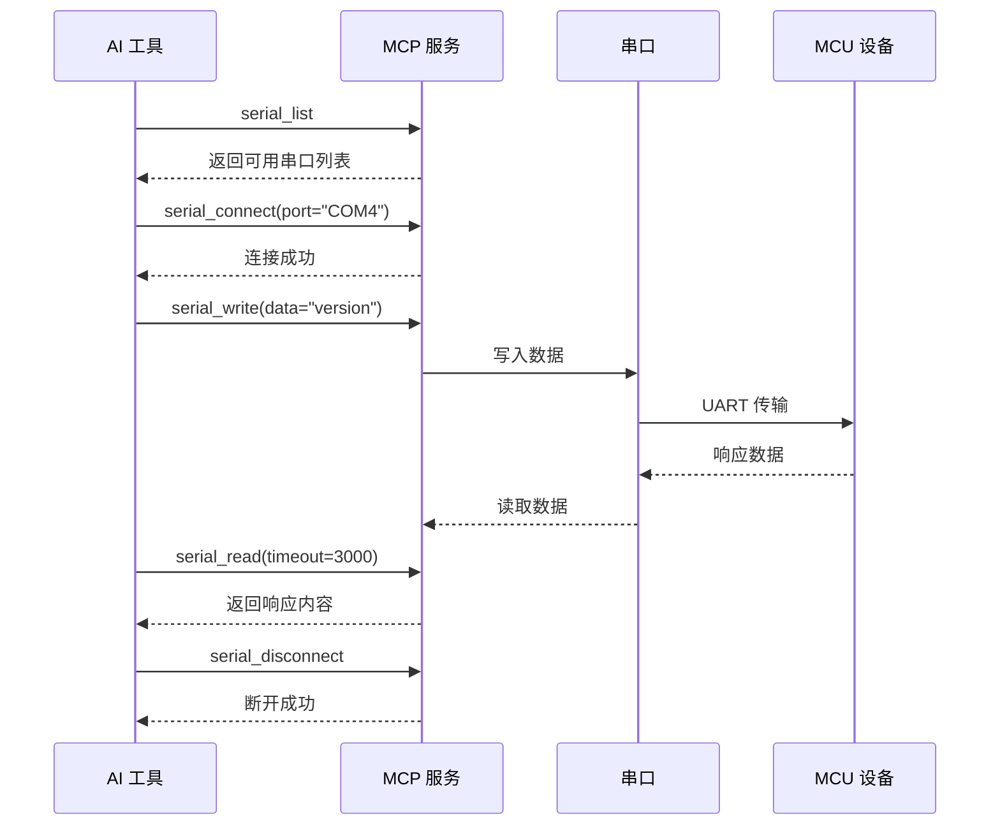
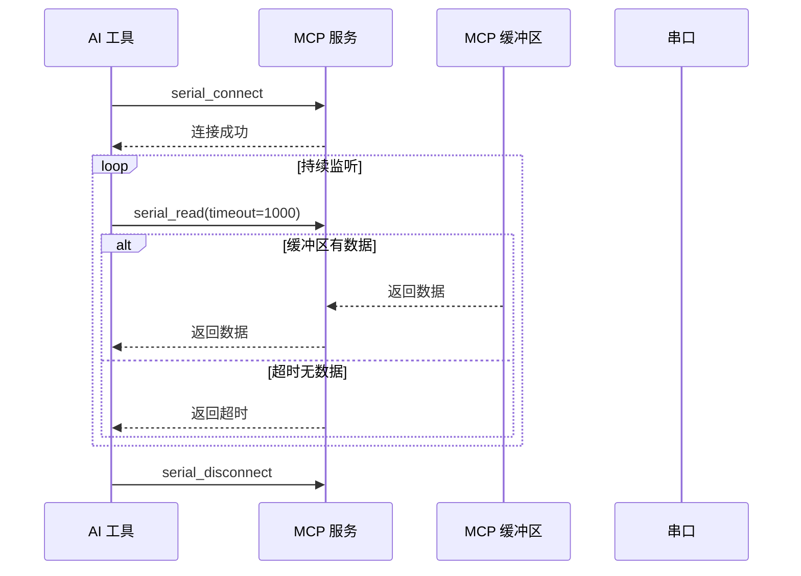
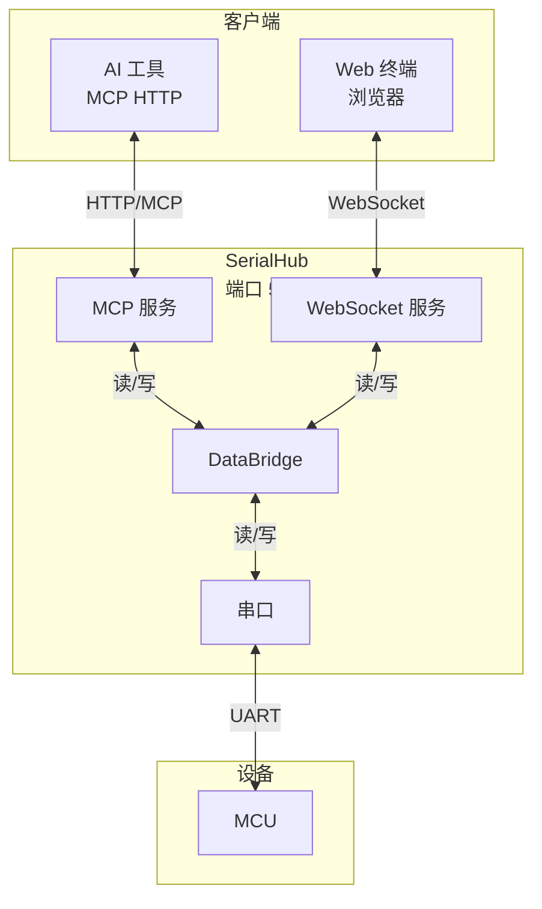

# SerialHub MCP 使用指南

## 概述

SerialHub 实现 [MCP (Model Context Protocol)](https://modelcontextprotocol.io/) HTTP 服务，允许 AI 工具通过标准 HTTP API 与串口设备交互。

| 属性 | 值 |
|------|-----|
| 传输模式 | StreamableHTTP (Stateless + JSONResponse) |
| 端点 | `http://<host>:<port>/mcp` |
| 协议 | JSON-RPC 2.0 |
| 默认端口 | 5000 |

---

## 快速开始

### 1. 启动服务

```bash
# 默认配置启动
./bin/serialhub --no-tray

# 指定 MCP 端口
./bin/serialhub --no-tray --mcp-port 55555
```

### 2. 验证服务

```bash
# 健康检查
curl http://127.0.0.1:5000/health

# 列出可用串口
curl -X POST http://127.0.0.1:5000/mcp \
  -H "Content-Type: application/json" \
  -d '{"jsonrpc":"2.0","method":"tools/call","params":{"name":"serial_list"},"id":1}'
```

---

## MCP 工具参考

### 工具列表

| 工具名 | 功能 | 必需参数 |
|--------|------|----------|
| `serial_list` | 列出系统中所有可用串口 | 无 |
| `serial_status` | 获取当前串口连接状态 | 无 |
| `serial_connect` | 连接到指定串口 | `port` |
| `serial_disconnect` | 断开当前串口连接 | 无 |
| `serial_write` | 向串口写入数据 | `data` |
| `serial_read` | 从串口读取数据（阻塞式） | 无 |
| `serial_clear` | 清空 read 缓冲区（丢弃未消费数据） | 无 |

### 参数详解

#### serial_connect

```json
{
  "port": "COM4",        // 必填：串口号
  "baudRate": 115200,    // 可选：波特率，默认 115200
  "dataBits": 8,         // 可选：数据位 (7/8)，默认 8
  "parity": "none",      // 可选：校验位 (none/even/odd)，默认 none
  "stopBits": 1          // 可选：停止位 (1/1.5/2)，默认 1
}
```

#### serial_write

```json
{
  "data": "Hello World",  // 必填：要写入的数据
  "addNewline": true      // 可选：是否自动追加 \n，默认 true（未指定时也追加）
}
```

#### serial_read

```json
{
  "timeout": 3000,   // 可选：超时时间(ms)，0=无限等待，默认 1000
  "maxSize": 4096    // 可选：最大读取字节数，默认 4096
}
```

---

## 使用示例

### cURL 示例

#### 连接串口
```bash
curl -X POST http://127.0.0.1:5000/mcp \
  -H "Content-Type: application/json" \
  -d '{
    "jsonrpc": "2.0",
    "method": "tools/call",
    "params": {
      "name": "serial_connect",
      "arguments": {"port": "COM4", "baudRate": 115200}
    },
    "id": 1
  }'
```

#### 写入数据
```bash
curl -X POST http://127.0.0.1:5000/mcp \
  -H "Content-Type: application/json" \
  -d '{
    "jsonrpc": "2.0",
    "method": "tools/call",
    "params": {
      "name": "serial_write",
      "arguments": {"data": "help", "addNewline": true}
    },
    "id": 2
  }'
```

#### 读取响应
```bash
curl -X POST http://127.0.0.1:5000/mcp \
  -H "Content-Type: application/json" \
  -d '{
    "jsonrpc": "2.0",
    "method": "tools/call",
    "params": {
      "name": "serial_read",
      "arguments": {"timeout": 5000}
    },
    "id": 3
  }'
```

### Python 示例

```python
import requests

def mcp_call(port, tool_name, arguments=None):
    """调用 MCP 工具"""
    resp = requests.post(
        f"http://127.0.0.1:{port}/mcp",
        headers={"Content-Type": "application/json"},
        json={
            "jsonrpc": "2.0",
            "method": "tools/call",
            "params": {"name": tool_name, "arguments": arguments or {}},
            "id": 1
        },
        timeout=10
    )
    return resp.json()

# 标准工作流程
mcp_call(5000, "serial_list")                                    # 1. 查找串口
mcp_call(5000, "serial_connect", {"port": "COM4"})              # 2. 连接
mcp_call(5000, "serial_write", {"data": "version"})             # 3. 发送命令
result = mcp_call(5000, "serial_read", {"timeout": 3000})       # 4. 读取响应
print(result["result"]["content"][0]["text"])
mcp_call(5000, "serial_disconnect")                             # 5. 断开连接
```

### OpenCode MCP 配置

OpenCode 支持两种配置级别，**项目级 > 用户级**。

| 级别 | 配置文件路径 | 适用场景 |
|------|-------------|---------|
| 用户级 | `~/.opencode/opencode.json` | 个人开发，全局共用 |
| 项目级 | `opencode.json`（项目根目录） | 团队协作，独立配置 |

```json
{
  "mcp": {
    "serialhub": {
      "type": "remote",
      "url": "http://127.0.0.1:5000/mcp",
      "enabled": true
    }
  }
}
```

**远程 SerialHub 示例**：`"url": "http://192.168.1.100:5000/mcp"`

---

## 典型工作流

### 1. 标准命令-响应模式



### 2. 持续监听模式



```python
# 连接后循环读取
mcp_call(5000, "serial_connect", {"port": "COM4"})
while True:
    result = mcp_call(5000, "serial_read", {"timeout": 1000})
    if not result["result"]["content"][0]["text"].endswith("timedOut: true"):
        print("收到数据:", result)
```

### 3. 系统架构



**架构特点**:
- **双向通信**: MCP 和 Web 终端均可独立读写串口
- **数据共享**: 串口数据同时广播到所有客户端
- **故障隔离**: 任一端故障不影响其他端

---

## 错误处理

### 常见错误

| 错误码 | 场景 | 解决方案 |
|--------|------|----------|
| -32700 | JSON 解析错误 | 检查请求格式 |
| -32600 | 请求不是有效的 JSON-RPC 对象 | 检查请求结构 |
| -32601 | 工具名不存在 | 检查工具名拼写 |
| -32602 | 参数解析失败或参数无效 | 检查 arguments 格式 |
| `isError: true` | 工具执行失败（如串口未连接、写入失败） | 查看 `result.content` 中的错误描述，调用 `serial_connect` 后重试 |

> 说明：工具执行类错误（如"串口未连接"）通过 `result` 中的 `isError: true` 返回，而非 JSON-RPC 协议级错误，便于 LLM 感知失败并自我纠正。

### 错误响应示例

```json
{
  "jsonrpc": "2.0",
  "id": 1,
  "error": {
    "code": -32602,
    "message": "参数解析错误: json: cannot unmarshal ..."
  }
}
```

### 工具失败响应示例（isError）

```json
{
  "jsonrpc": "2.0",
  "id": 1,
  "result": {
    "content": [
      {
        "type": "text",
        "text": "串口未连接"
      }
    ],
    "isError": true
  }
}
```

---

## 相关文件

| 文件 | 说明 |
|------|------|
| `pkg/mcp/server.go` | MCP HTTP 服务实现 |
| `pkg/mcp/tools/*.go` | MCP 工具实现 |
| `pkg/bridge/bridge.go` | 数据桥接核心 |
| `tests/integration/test_serialhub.py` | Python 集成测试 |

---

## 参考链接

- [MCP 规范](https://modelcontextprotocol.io/)
- [项目架构](./AGENTS.md)
- [主文档](./README.md)
