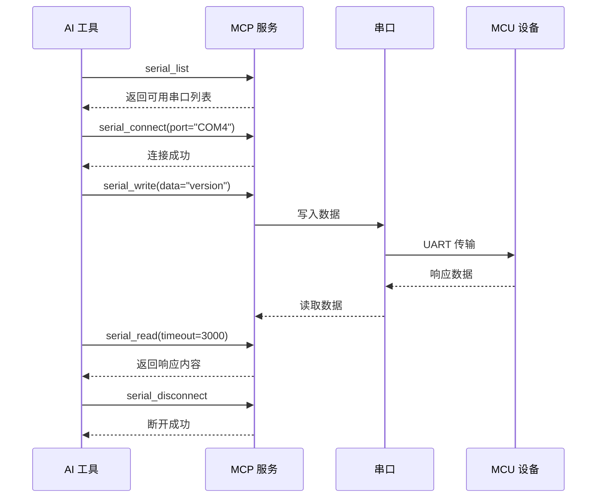
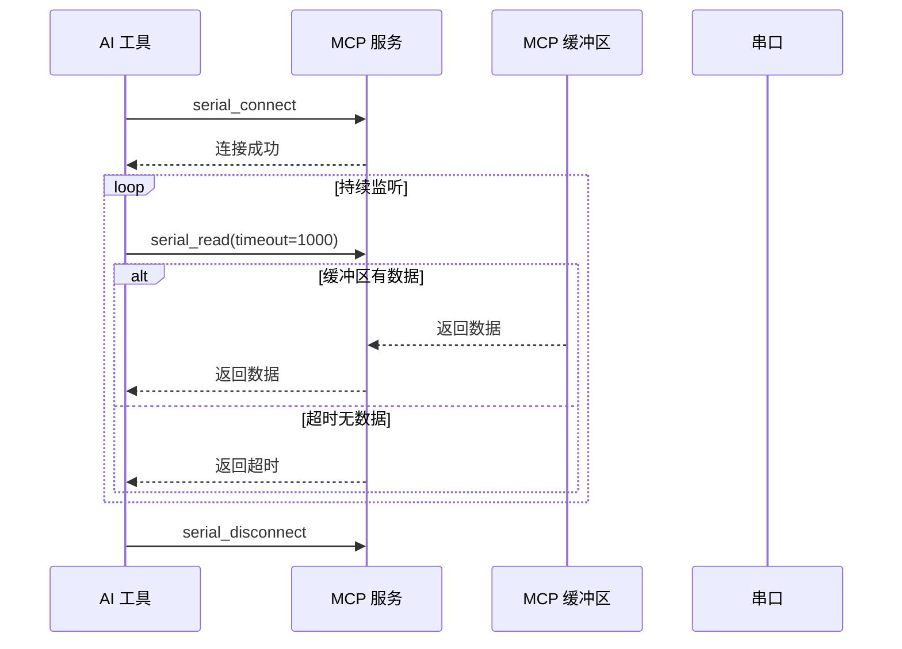
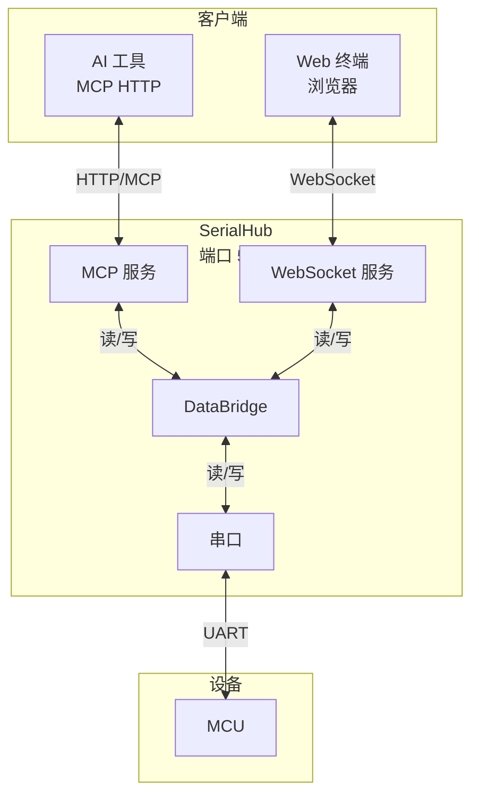

# SerialHub MCP 使用指南

## 概述

SerialHub 实现 [MCP (Model Context Protocol)](https://modelcontextprotocol.io/) HTTP 服务，允许 AI 工具通过标准 HTTP API 与串口设备交互。

| 属性 | 值 |
|------|-----|
| 传输模式 | Streamable HTTP（Stateless · 非流式 JSON 响应） |
| 端点 | `http://<host>:<port>/mcp` |
| 协议 | JSON-RPC 2.0 |
| 默认端口 | 5050 |

同一用户配置/安装作用域同时只允许一个主实例（`instance.lock` 互斥）；stdio 模式自动发现已运行实例并透明代理（详见 [stdio 模式](#stdio-模式客户端本地拉起)）。

---

## 快速开始

### 1. 启动服务

```bash
# 默认配置启动
./bin/serialhub

# 指定 MCP 端口与监听地址
./bin/serialhub --mcp-port 55555 --host 0.0.0.0
```

### 2. 验证服务

```bash
# 健康检查
curl http://127.0.0.1:5050/health

# 列出可用串口
curl -X POST http://127.0.0.1:5050/mcp \
  -H "Content-Type: application/json" \
  -d '{"jsonrpc":"2.0","method":"tools/call","params":{"name":"serial_list"},"id":1}'
```

---

## MCP 工具参考

### 工具列表

| 工具名 | 功能 | 必需参数 |
|--------|------|----------|
| `serial_list` | 列出所有可用串口 | 无 |
| `serial_status` | 获取当前串口连接状态 | 无 |
| `serial_connect` | 连接到指定串口 | `port` |
| `serial_disconnect` | 断开当前串口连接 | 无 |
| `serial_write` | 向串口写入数据 | `data` |
| `serial_read` | 从串口读取数据（阻塞式） | 无 |
| `serial_clear` | 清空 read 缓冲区（丢弃未消费数据） | 无 |
| `serial_script` | 执行交互脚本：定时写 + 匹配写（阻塞至完成/超时） | `timeoutMs` |

`serial_list` 返回结构（顶层 `side`/`sideDetail` 为本实例所在系统与具体来源；`ports` 数组每项含 `name`/`origin`/`side`/`port`）：

```json
{
  "message": "找到 2 个串口",
  "side": "wsl",
  "sideDetail": "Ubuntu",
  "ports": [
    {"name": "/dev/ttyUSB0", "origin": "local", "side": "wsl", "port": "/dev/ttyUSB0"},
    {"name": "/dev/ttyUSB1", "origin": "local", "side": "wsl", "port": "/dev/ttyUSB1"}
  ]
}
```

- 顶层 `side`：本实例所在系统（`windows` / `wsl` / `linux` / `darwin`），Windows/WSL 双实例并存时用于区分来源；`serial_status` 的返回同样带该字段
- 顶层 `sideDetail`：更具体的来源——WSL 为发行版名（如 `Ubuntu`），其他平台为主机名（如 `DONG21`），区分多发行版/多主机；`serial_status` 同样带
- 条目 `origin`: 恒为 `local`（本实例直连端口，`name` 为裸名；字段为兼容旧客户端保留）
- 条目 `side`：端口所在侧（实例直连本地端口，与顶层一致）

### 参数详解

#### serial_connect

```json
{
  "port": "COM4",        // 必填：串口号
  "baudRate": 115200,    // 可选：波特率，默认 115200
  "dataBits": 8,         // 可选：数据位 (7/8)，默认 8
  "parity": "none",      // 可选：校验位 (none/even/odd)，默认 none
  "stopBits": 1          // 可选：停止位 (1/1.5/2)，默认 1
}
```

> 幂等：目标端口已处于打开状态时重复调用返回成功（携带当前连接信息）；已连接**其他**端口时返回失败，需先 `serial_disconnect`。

#### serial_write

```json
{
  "data": "Hello World",  // 必填：要写入的数据
  "addNewline": true      // 可选：是否自动追加 \n，默认 true（未指定时也追加）
}
```

#### serial_read

```json
{
  "timeout": 3000,   // 可选：超时时间(ms)，0=无限等待，默认 1000
  "maxSize": 4096    // 可选：最大读取字节数，默认 4096
}
```

#### serial_script

```json
{
  "timeoutMs": 10000,             // 必填：剧本总超时(ms)，允许范围由 config.toml [script] 决定（默认 100ms～30min）
  "writes": [                     // 可选：定时写（相对脚本启动）
    {"atMs": 0, "data": "help"},  //   单发：atMs 偏移（默认 0）
    {"atMs": 1000, "intervalMs": 500, "count": 3, "data": "ping"}  //   周期：首拍在 atMs，其后每 intervalMs 一次共 count 次
  ],
  "matches": [                    // 可选：匹配写（Go 正则，收到的数据命中即写）
    {"pattern": "OK", "data": "next", "addNewline": true, "repeat": false, "maxCount": 0}
    //   repeat: false=单发（默认，命中一次后失效）；true=可重复触发
    //   maxCount: repeat=true 且 >0 时的最大触发次数，耗尽后失效
    //   多条规则按声明顺序对同一段数据全部执行
    //   零宽命中（如 "^" 空匹配）不触发；"^" 锚定当前扫描窗口起点，repeat 不会对后缀重新锚定
  ],
  "returnData": true              // 可选：返回期间收到的回放数据，默认 true
}
```

- **语义**：观察式（Tee）——数据照常进入 read 缓冲，`serial_read`/Web 终端不受影响；只匹配脚本启动后新到的数据；数据以**到达时刻**判定，超时后才到达的不参与匹配也不计入回放；全局同时只能运行一个脚本；期间 `serial_write` 仍可并发调用。
- **完成条件**：定时写全部发出 **且** 每条匹配规则至少命中 1 次 → 提前返回成功。
- **超时**：返回成功且 `timedOut: true`，`pendingRules` 列出未命中的匹配规则下标（同 `serial_read` 超时先例）。
- **失败**：串口断连（含断连后快速重连，按连接代次判定）、ctx 取消（"脚本已取消"）、写入失败、参数非法（空剧本、timeoutMs 越界、未连接、已有脚本在跑）。

返回 `data` 字段：

```json
{
  "timedOut": false,
  "triggers": [{"type": "timed|match", "rule": 0, "occurrence": 0, "atMs": 12, "data": "...", "matched": "..."}],
  "ruleFireCounts": [2],
  "pendingRules": [],
  "writesFired": 4, "writesTotal": 4,
  "receivedBytes": 128,
  "received": "...",               // returnData=true 时给出；回放仅保留最新 1MB
  "receivedTruncated": false       // 回放是否因超出 1MB 上限被截断（总接收量见 receivedBytes）
}
```

触发记录字段：`type`（`timed`/`match`）、`rule`（writes/matches 数组下标）、`occurrence`（timed=周期第 i 拍、match=该规则第几次命中，均从 0 起）、`atMs`（相对启动毫秒）、`data`（实际发送内容）、`matched`（仅 match：命中的文本片段）。

---

## 使用示例

### cURL 示例

#### 连接串口
```bash
curl -X POST http://127.0.0.1:5050/mcp \
  -H "Content-Type: application/json" \
  -d '{
    "jsonrpc": "2.0",
    "method": "tools/call",
    "params": {
      "name": "serial_connect",
      "arguments": {"port": "COM4", "baudRate": 115200}
    },
    "id": 1
  }'
```

#### 写入数据
```bash
curl -X POST http://127.0.0.1:5050/mcp \
  -H "Content-Type: application/json" \
  -d '{
    "jsonrpc": "2.0",
    "method": "tools/call",
    "params": {
      "name": "serial_write",
      "arguments": {"data": "help", "addNewline": true}
    },
    "id": 2
  }'
```

#### 读取响应
```bash
curl -X POST http://127.0.0.1:5050/mcp \
  -H "Content-Type: application/json" \
  -d '{
    "jsonrpc": "2.0",
    "method": "tools/call",
    "params": {
      "name": "serial_read",
      "arguments": {"timeout": 5000}
    },
    "id": 3
  }'
```

### Python 示例

```python
import requests

def mcp_call(port, tool_name, arguments=None):
    """调用 MCP 工具"""
    resp = requests.post(
        f"http://127.0.0.1:{port}/mcp",
        headers={"Content-Type": "application/json"},
        json={
            "jsonrpc": "2.0",
            "method": "tools/call",
            "params": {"name": tool_name, "arguments": arguments or {}},
            "id": 1
        },
        timeout=10
    )
    return resp.json()

# 标准工作流程
mcp_call(5050, "serial_list")                                    # 1. 查找串口
mcp_call(5050, "serial_connect", {"port": "COM4"})              # 2. 连接
mcp_call(5050, "serial_write", {"data": "version"})             # 3. 发送命令
result = mcp_call(5050, "serial_read", {"timeout": 3000})       # 4. 读取响应
print(result["result"]["content"][0]["text"])
mcp_call(5050, "serial_disconnect")                             # 5. 断开连接
```

### MCP 客户端配置（通用）

SerialHub 是标准 MCP 服务器，任何支持 **Streamable HTTP** 或 **stdio** 的客户端都能接入：

- **HTTP 端点**：`http://127.0.0.1:5050/mcp`
- **stdio 命令**：`serialhub --stdio`（客户端本地拉起；有主实例时自动透明代理）

**一键配置**：运行 `serialhub setup` 交互式向导（或非交互
`serialhub setup --client cursor -y`），自动为 OpenCode / Claude Code / Cursor /
Windsurf / VS Code / Codex 合并写入接入配置（不动其他服务条目；已有
serialhub 条目时交互模式会确认，`-y` 直接更新——可借此切换 stdio/HTTP；
Codex 与 Claude Code 用户级经官方 CLI 写入，已有条目的处理遵循该 CLI
行为）。默认写入 **stdio 本地模式**
（客户端自动拉起、无需先启动 SerialHub 服务）；如需 HTTP 端点显式指定
`--mode http`。
以下为各客户端的手动配置方法。

**铁律：永远写 `127.0.0.1:5050`**。stdio 模式有已运行实例时自动代理（经 `instance.lock` 发现）；HTTP 直连就是实例本身。访问局域网其他机器上的 SerialHub 时才改地址，如 `http://192.168.1.100:5050/mcp`。

#### OpenCode

配置文件：用户级 `~/.config/opencode/opencode.json`，项目级 `opencode.json`（项目根目录，优先级更高）。
OpenCode V2 要求 MCP 服务器嵌套在 `mcp.servers` 下：

```json
{
  "mcp": {
    "servers": {
      "serialhub": {
        "type": "remote",
        "url": "http://127.0.0.1:5050/mcp",
        "oauth": false
      }
    }
  }
}
```

stdio 方式（免手动启动，OpenCode 拉起子进程并随其退出；`command` 为「可执行文件+参数」数组）：

```json
{
  "mcp": {
    "servers": {
      "serialhub": {
        "type": "local",
        "command": ["serialhub", "--stdio"]
      }
    }
  }
}
```

#### Claude Code

```bash
# HTTP
claude mcp add --transport http serialhub http://127.0.0.1:5050/mcp

# stdio
claude mcp add serialhub -- serialhub --stdio
```

或项目根目录 `.mcp.json`（团队共享）：

```json
{
  "mcpServers": {
    "serialhub": { "type": "http", "url": "http://127.0.0.1:5050/mcp" }
  }
}
```

#### Cursor

`~/.cursor/mcp.json`（全局）或项目 `.cursor/mcp.json`：

```json
{
  "mcpServers": {
    "serialhub": { "url": "http://127.0.0.1:5050/mcp" }
  }
}
```

#### Windsurf

`~/.codeium/windsurf/mcp_config.json`：

```json
{
  "mcpServers": {
    "serialhub": { "serverUrl": "http://127.0.0.1:5050/mcp" }
  }
}
```

#### VS Code（Copilot）

`.vscode/mcp.json`（可提交入库）：

```json
{
  "servers": {
    "serialhub": { "type": "http", "url": "http://127.0.0.1:5050/mcp" }
  }
}
```

stdio 方式把 `type` 换成 `"stdio"`，用 `"command": "serialhub", "args": ["--stdio"]`。

> 注：SerialHub 的 HTTP 传输为**非流式 JSON 响应**（Stateless 模式），不依赖 SSE；
> 支持 Streamable HTTP 的客户端均可正常使用。stdio 模式则与传输实现无关，任何客户端通用。

---

## 单实例互斥与 stdio 发现

同一用户配置/安装目录同时只允许一个主实例，由 OS 文件锁保证：

- **lock 位置**：Linux/macOS 为 `~/.config/serialhub/instance.lock`（XDG，与配置同目录）；Windows 固定为 `%LOCALAPPDATA%\serialhub\instance.lock`（用户级，与 exe 位置无关——任意位置/多副本的 Windows 实例共享同一把锁）。
- **内容**：JSON，记录主实例的 `pid`、`port`、`host`、`started_at`。
- **互斥**：主实例持有文件锁直至退出；已有持有者时再启动不报错，转 stdio 透明代理挂起（尽力展示地址；`serialhub upgrade` 等命令不受影响）。文件本身不删除。
- **stdio 发现**：`serialhub --stdio` 读 lock 的 OS 锁状态及地址（非端口扫描）——有活主则透明代理到该实例，无主则自成主实例。
- **异常退出**：内核自动释放锁；常驻文件中的旧信息由下一次取得锁的实例覆盖，不代表仍有主实例。

```bash
# 已有实例运行时再启动（自动转代理，Ctrl+C 退出）：
$ serialhub
[SerialHub] 检测到主实例 http://127.0.0.1:5050（pid 12345），本进程以代理模式运行（Ctrl+C 退出）
[SerialHub] 主实例 http://127.0.0.1:5050 就绪，以透明代理运行

# stdio 模式自动代理（MCP 客户端无感知）：
$ serialhub --stdio
[SerialHub] 主实例 http://127.0.0.1:5050 就绪，以透明代理运行
```

> Windows 与 WSL 是两套独立的用户目录/exe 目录，各自持有一份 lock——两侧各跑一个实例互不冲突，串口各自独立（跨侧访问请用局域网地址）。

### 跨系统端口冲突与 side 标识

NAT 模式的 WSL2 开启 localhost 转发时，一侧实例先启动会由 `wslrelay` 预占另一侧的同端口号，导致对侧实例 bind 失败。SerialHub 的处理：**端口被占时自动 +1 递增重试（最多 10 个）**，成功后日志提示实际端口并更新 lock；`config.toml` 仍记录请求的端口（迁移仅本次运行期生效）。

区分两个实例（Web 终端标题栏徽标、`/health`、`serial_list` 顶层、`serial_status`）均带 `side` 字段：`windows` / `wsl` / `linux` / `darwin`。

---

## 典型工作流


### 1. 标准命令-响应模式


```mermaid
sequenceDiagram
    participant AI as AI 工具
    participant MCP as MCP 服务
    participant Serial as 串口
    participant MCU as MCU 设备

    AI->>MCP: serial_list
    MCP-->>AI: 返回可用串口列表
    AI->>MCP: serial_connect(port="COM4")
    MCP-->>AI: 连接成功
    AI->>MCP: serial_write(data="version")
    MCP->>Serial: 写入数据
    Serial->>MCU: UART 传输
    MCU-->>Serial: 响应数据
    Serial-->>MCP: 读取数据
    AI->>MCP: serial_read(timeout=3000)
    MCP-->>AI: 返回响应内容
    AI->>MCP: serial_disconnect
    MCP-->>AI: 断开成功
```

### 2. 持续监听模式


```mermaid
sequenceDiagram
    participant AI as AI 工具
    participant MCP as MCP 服务
    participant Buffer as MCP 缓冲区
    participant Serial as 串口

    AI->>MCP: serial_connect
    MCP-->>AI: 连接成功

    loop 持续监听
        AI->>MCP: serial_read(timeout=1000)
        alt 缓冲区有数据
            Buffer-->>MCP: 返回数据
            MCP-->>AI: 返回数据
        else 超时无数据
            MCP-->>AI: 返回超时
        end
    end

    AI->>MCP: serial_disconnect
```

```python
# 连接后循环读取
mcp_call(5050, "serial_connect", {"port": "COM4"})
while True:
    result = mcp_call(5050, "serial_read", {"timeout": 1000})
    if not result["result"]["content"][0]["text"].endswith("timedOut: true"):
        print("收到数据:", result)
```

### 3. 系统架构


```mermaid
flowchart TB
    subgraph Clients["客户端"]
        AI["AI 工具<br/>MCP HTTP"]
        Web["Web 终端<br/>浏览器"]
    end

    subgraph SerialHub["SerialHub<br/>端口 5050"]
        MCP["MCP 服务"]
        WS["WebSocket 服务"]
        Bridge["DataBridge"]
        Serial["串口"]
    end

    subgraph Device["设备"]
        MCU["MCU"]
    end

    AI <-->|HTTP/MCP| MCP
    Web <-->|WebSocket| WS
    MCP <-->|读/写| Bridge
    WS <-->|读/写| Bridge
    Bridge <-->|读/写| Serial
    Serial <-->|UART| MCU
```

**架构特点**:
- **双向通信**: MCP 和 Web 终端均可独立读写串口
- **数据共享**: 串口数据同时广播到所有客户端
- **故障隔离**: 任一端故障不影响其他端

### 4. 工具使用时机

| 场景 | 推荐工具 | 说明 |
|------|----------|------|
| 不知道串口名 | `serial_list` | 获取可用串口列表，根据 vendorId/productId 或厂商名识别目标设备 |
| 开始调试前 | `serial_connect` | 必须先连接串口才能进行后续操作 |
| 发送 Shell 命令 | `serial_write` + `serial_read` | 写入后立即读取响应，如 `help`、`version`、`reboot` |
| 发送调试指令 | `serial_write` | 向 MCU 发送控制命令或配置参数 |
| 获取命令输出 | `serial_read` | 读取设备返回的数据，timeout=0 无限等待适合不确定响应时间 |
| 检查连接状态 | `serial_status` | 操作前确认已连接，或操作失败时检查连接是否断开 |
| 切换设备 | `serial_disconnect` → `serial_connect` | 先断开当前连接，再连接新设备 |
| 结束会话 | `serial_disconnect` | 释放串口资源 |

### 5. 最佳实践

1. **始终先检查状态**：复杂操作前调用 `serial_status` 确认连接有效
2. **匹配波特率**：`baudRate` 必须与目标设备配置一致，常见值 115200、9600
3. **合理设置 timeout**：常规命令 1-5 秒，耗时操作设为 0（无限等待）
4. **发送后立即读取**：`serial_write` 完成后立即 `serial_read`，避免数据堆积
5. **解析输出时考虑换行**：大多数 Shell 命令响应包含 `\n` 换行符

---

## 错误处理

### 常见错误

| 错误码 | 场景 | 解决方案 |
|--------|------|----------|
| -32700 | JSON 解析错误 | 检查请求格式 |
| -32600 | 请求不是有效的 JSON-RPC 对象 | 检查请求结构 |
| -32601 | 工具名不存在 | 检查工具名拼写 |
| -32602 | 参数解析失败或参数无效 | 检查 arguments 格式 |
| `isError: true` | 工具执行失败（如串口未连接、写入失败） | 查看 `result.content` 中的错误描述，调用 `serial_connect` 后重试 |

> 说明：工具执行类错误（如"串口未连接"）通过 `result` 中的 `isError: true` 返回，而非 JSON-RPC 协议级错误，便于 LLM 感知失败并自我纠正。

### 错误响应示例

```json
{
  "jsonrpc": "2.0",
  "id": 1,
  "error": {
    "code": -32602,
    "message": "参数解析错误: json: cannot unmarshal ..."
  }
}
```

### 工具失败响应示例（isError）

```json
{
  "jsonrpc": "2.0",
  "id": 1,
  "result": {
    "content": [
      {
        "type": "text",
        "text": "串口未连接"
      }
    ],
    "isError": true
  }
}
```

---

## 相关文件

| 文件 | 说明 |
|------|------|
| `pkg/mcp/server.go` | MCP HTTP 服务实现 |
| `pkg/mcp/tools/*.go` | MCP 工具实现 |
| `pkg/bridge/bridge.go` | 数据桥接核心 |
| `tests/integration/` | Python 集成测试 |

---

## 参考链接

- [MCP 规范](https://modelcontextprotocol.io/)
- [项目架构](./AGENTS.md)
- [主文档](./README.md)
