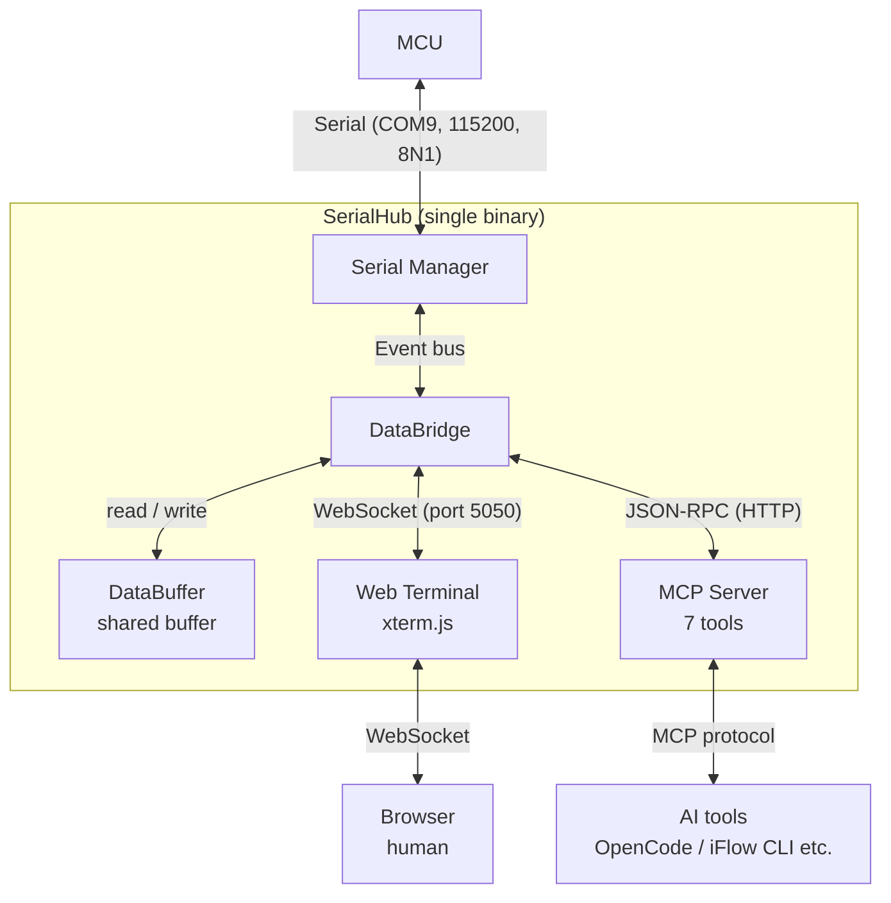

# SerialHub

English | [简体中文](./README.md)

A two-way bridge between serial ports (MCU) and network clients (Web terminal / AI tools).

**📚 Docs**: [Quick Start](./QUICKSTART.md) (中文) | [MCP Guide](./MCP.md) (中文) | [Config & Architecture](./AGENTS.md) | [Release Process](./RELEASING.md) | [Integration Tests](./tests/integration/README.md)

## Overview

SerialHub bridges a single MCU serial port to both humans and AI:

- **Humans**: an xterm.js Web terminal in the browser for live viewing and input (opens automatically on startup; on WSL it opens the Windows host browser)
- **AI**: a native MCP server (Streamable HTTP + stdio) exposing 8 tools — `serial_list` / `serial_connect` / `serial_write` / `serial_read` / `serial_clear` / `serial_disconnect` / `serial_status` / `serial_script`
- Both channels share **the same serial connection and data buffer** — humans and AI see the same bytes
- **Single-instance lock**: one master instance per scope (Windows: one lock per user at `%LOCALAPPDATA%\serialhub\`; Linux/macOS: per user-config directory) enforced by an OS file lock; a duplicate launch transparently proxies to the running instance instead of failing; if the port is occupied (e.g. Windows/WSL localhost-forwarding conflict) it auto-increments
- A single Go binary (frontend embedded); supports Windows (system tray) / Linux / macOS; everything configurable via TOML or CLI flags, data logging on demand (`--log-data`)

## Architecture



## Installation

### Option 1: Prebuilt archive (recommended)

**One-line install** (finds the latest release, downloads and verifies; set `SERIALHUB_GITHUB_API` to use a mirror):

```bash
# Linux (installs to ~/.local/bin)
curl -fsSL https://raw.githubusercontent.com/dongly/serialhub/main/install.sh | bash
```

```powershell
# Windows (installs to %LOCALAPPDATA%\Programs\serialhub and adds to user PATH)
irm https://raw.githubusercontent.com/dongly/serialhub/main/install.ps1 | iex
```

Or download the archive for your platform manually from
[GitHub Releases](https://github.com/dongly/serialhub/releases) (Windows `.zip` / Linux `.tar.gz`; the archive contains a top-level version directory).

**Linux**:

```bash
VER=$(curl -s https://api.github.com/repos/dongly/serialhub/releases/latest | grep -oP '"tag_name":\s*"\K[^"]+')
curl -LO "https://github.com/dongly/serialhub/releases/download/${VER}/serialhub-${VER#v}-linux-amd64.tar.gz"
tar -xzf serialhub-*-linux-amd64.tar.gz
sudo cp serialhub-*-linux-amd64/serialhub /usr/local/bin/ && serialhub --version
```

**Windows**: download the `.zip`, extract to any directory (e.g. `D:\Tools\serialhub`; ships `sr.ps1` / `sr.bat` launcher scripts), then add it to PATH (PowerShell):

```powershell
[Environment]::SetEnvironmentVariable("Path", $env:Path + ";D:\Tools\serialhub", "User")
```

### Option 2: Build from source (the only way on macOS; requires Go 1.26+)

```bash
git clone https://github.com/dongly/serialhub && cd serialhub
go build -o serialhub ./cmd/serialhub        # Windows: -o serialhub.exe
```

### Upgrade & uninstall

```bash
serialhub upgrade          # fetch latest release, verify checksum, atomically replace itself (config and logs preserved)
serialhub uninstall        # uninstall: dry-run list, then clean MCP entries / config / logs / binary
```

Proxies honor `HTTPS_PROXY` / `HTTP_PROXY`; a private mirror can be set via
`SERIALHUB_GITHUB_API` (default `https://api.github.com`).
Full steps (PATH setup, install verification, WSL USB serial attach) see
[QUICKSTART.md](./QUICKSTART.md) (Chinese).

## Quick Start

**Scenario: human + AI debugging together**

1. Start SerialHub:

```bash
serialhub -p COM9 --host 0.0.0.0 -D
```

2. Human watches via the Web terminal: open `http://localhost:5050/terminal`

3. AI tools connect via HTTP MCP:

```json
{
  "mcp": {
    "servers": {
      "serialhub": {
        "type": "remote",
        "url": "http://localhost:5050/mcp",
        "oauth": false
      }
    }
  }
}
```

4. Serial data is forwarded to both the Web terminal and the AI interface; each can send commands independently.

> One-command MCP client setup: `serialhub setup` (stdio local mode by default; supports OpenCode / Claude Code / Cursor / Windsurf / VS Code / Codex).

## Command Reference

### `serialhub` (default: serve mode)

```bash
serialhub                                    # start with defaults
serialhub -p COM8                            # specify serial port
serialhub -p COM8 -b 9600 --parity even      # full serial parameters
serialhub -m 8080                            # use port 8080
serialhub --host 0.0.0.0                     # listen on all interfaces (LAN access)
serialhub --stdio                            # stdio mode (spawned by MCP clients)
serialhub -c config.toml                     # use a config file
serialhub -D                                 # debug mode
```

| Option | Short | Description | Default |
|--------|-------|-------------|---------|
| `--serial-port <port>` | `-p` | Serial port name | config file or empty |
| `--baud-rate <rate>` | `-b` | Baud rate | 115200 |
| `--data-bits <bits>` | `-d` | Data bits (5/6/7/8) | 8 |
| `--parity <type>` | - | Parity (none/even/odd) | none |
| `--stop-bits <bits>` | `-s` | Stop bits (1/2) | 1 |
| `--mcp-port <port>` | `-m` | MCP HTTP service port (auto-increments by 1 when occupied, up to 10 tries) | 5050 |
| `--host <host>` | - | Listen address | 127.0.0.1 |
| `--config <path>` | `-c` | Config file path | - |
| `--debug` | `-D` | Enable debug mode | false |
| `--log-data` | - | Emit data-content logs (500ms window aggregation, 512-byte display truncation; also `SERIALHUB_LOG_DATA=1`, explicit `--log-data=false` wins; neither is persisted to the config file) | false |
| `--stdio` | - | stdio mode: spawned by MCP clients (transparently proxies when a master instance exists) | false |
| `--minimized` | - | Launched by scripts; minimize window (also hides console on Windows); browser still opens by default | false |
| `--no-browser` | - | Skip auto-opening the browser (log still prints the Web terminal URL) | false |

On Windows the system tray starts by default (icon color reflects serial state; right-click menu to connect/disconnect, show console, quit) — see [QUICKSTART.md](./QUICKSTART.md#windows-系统托盘) (Chinese).

### Web Terminal

`http://localhost:5050/terminal`: live serial output, keyboard input forwarded to the serial port (Ctrl+C etc. supported), auto-reconnect. The UI follows the browser language; click “中文 / English” to switch and remember your choice. The serial port and connection parameters (baud rate/data bits/parity/stop bits) remember your last connection, and refreshing the port list returns to it. The "Exit" button remotely shuts down SerialHub (graceful shutdown; beware when exposed to LAN via `--host 0.0.0.0`, anyone who can open the page can stop the service).

### MCP Tools

| Tool | Description | Parameters |
|------|-------------|------------|
| `serial_list` | List all available serial ports | - |
| `serial_connect` | Connect to a serial port | `port` (required), `baudRate?` (default 115200) |
| `serial_disconnect` | Disconnect the current port | - |
| `serial_write` | Send data to the serial port | `data` (required), `addNewline?` (default true; set false to disable) |
| `serial_read` | Blocking read, returns when data arrives | `timeout?` (default 1000ms, 0 = wait forever), `maxSize?` (default 4096 bytes) |
| `serial_clear` | Clear the read buffer, discard unread data | - |
| `serial_status` | Get serial connection status | - |
| `serial_script` | Run an interaction script: timed writes (multiple) + match writes (regex-triggered, optional delay), blocking until completion or timeout | `timeoutMs` (required, 100ms–30min), `writes[]`, `matches[]`, `returnData?` |

Standard workflow: `serial_list` → `serial_connect` → `serial_write` → `serial_read` → `serial_disconnect`.
cURL/Python examples, typical workflows, error handling, when-to-use-which and best practices see [MCP.md](./MCP.md) (Chinese).

## Configuration

Precedence: **CLI flags > config file > defaults**

Config file lookup order (without `-c`):

- **Linux/macOS**: `./config.toml` (CWD) > `~/.config/serialhub/config.toml` (`XDG_CONFIG_HOME`); a legacy `config.toml` next to the binary is auto-migrated (moved) to the user config dir on first start if the user dir has none; if none exists anywhere, a new one is created in the user config dir.
- **Windows**: `config.toml` next to the executable (same as previous versions).

Persist timing: the merged config is written back **only after the single-instance lock is acquired** (i.e. becoming the master instance); a duplicate launch that proxies to the running master never modifies the config file (prevents `-m`-style flags from polluting the on-disk config).

Default log directory: `~/.config/serialhub/logs/` on Linux/macOS (legacy `logs/` history is not migrated), `logs/` next to the executable on Windows; overridable via `logDir` or `SERIALHUB_LOG_DIR`.

TOML format with `#` comments; full example in [config.example.toml](./config.example.toml):

```toml
[serial]
port = ""           # serial port; empty = no auto-connect
baudRate = 115200
dataBits = 8
parity = "none"     # none / even / odd
stopBits = 1

[mcp]
httpPort = 5050
```

## Development

```bash
go run ./cmd/serialhub          # dev run
go build -o bin/serialhub ./cmd/serialhub
go test ./...                   # tests (mock serial/conns in internal/testutil)
go vet ./...
```

- Testing Windows builds from WSL (tray, single-instance lock, PowerShell scripts): [docs/wsl-windows-testing.md](./docs/wsl-windows-testing.md) (Chinese).
- Hardware-in-the-loop tests are gated by `SERIALHUB_HARDWARE_TEST=1` with `SERIALHUB_TEST_PORT`.
- Release process: [RELEASING.md](./RELEASING.md).

## License

Released under the [Apache License 2.0](./LICENSE) (Copyright 2026 dongly).
