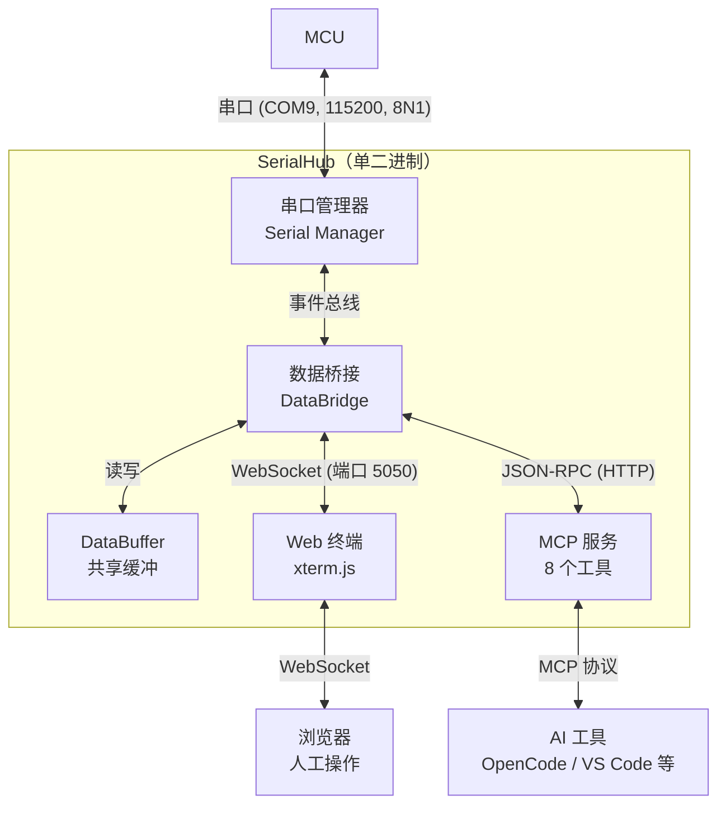

# SerialHub

[English](./README.en.md) | 简体中文

串口（MCU）与网络连接（Web 终端 / AI）之间的双向桥接器：把 MCU 串口同时桥接给人和 AI，单个 Go 二进制（前端内嵌），支持 Windows（系统托盘）/ Linux / macOS。

**📚 文档**：[快速开始](./QUICKSTART.md) | [MCP 使用指南](./MCP.md) | [配置与架构](./AGENTS.md) | [发布流程](./RELEASING.md) | [集成测试](./tests/integration/README.md)

## 项目简介

- **人**：浏览器里的 xterm.js Web 终端，实时查看与输入（启动后自动打开浏览器，WSL 下也能弹出 Windows 宿主浏览器）
- **AI**：原生 MCP 服务器（Streamable HTTP + stdio），提供 8 个工具（`serial_list` / `serial_connect` / `serial_write` / `serial_read` / `serial_clear` / `serial_disconnect` / `serial_status` / `serial_script`）
- 双通道共享**同一串口连接与数据缓冲**，人和 AI 看到的是同一串字节
- 所有参数均可通过 TOML 或命令行配置，数据流可按需记录（`--log-data`）

## 系统架构



## 安装

**一键安装**（自动查最新版、下载并校验；可用 `SERIALHUB_GITHUB_API` 指定加速基址）：

```bash
# Linux（装到 ~/.local/bin）
curl -fsSL https://raw.githubusercontent.com/dongly/serialhub/main/install.sh | bash
```

```powershell
# Windows：在 PowerShell 中运行（装到 %LOCALAPPDATA%\Programs\serialhub 并加入用户 PATH）
irm https://raw.githubusercontent.com/dongly/serialhub/main/install.ps1 | iex
```

- 手动下载、PATH 配置、安装验证、WSL USB 串口挂载等详细步骤见 [QUICKSTART.md](./QUICKSTART.md)。
- 源码构建（macOS 唯一方式；需 Go 1.26+）：`git clone https://github.com/dongly/serialhub && cd serialhub && go build -o serialhub ./cmd/serialhub`
- 自升级与卸载：`serialhub upgrade`（下载校验并原子替换自身）/ `serialhub uninstall`（dry-run 列清单确认后清理 MCP 条目 / 配置 / 日志 / 二进制）；代理遵从 `HTTPS_PROXY`。

## 快速开始

**场景：人工 + AI 同时调试**

1. 启动 SerialHub：

```bash
serialhub -p COM9 --host 0.0.0.0 -D
```

Windows 推荐用安装目录下的启动脚本 `.\sr.ps1 [参数]`（如 `.\sr.ps1 -p COM9 -D`）：

- 启动前强制结束仍在运行的旧 serialhub 进程（重启免手工关旧实例）；
- 以最小化窗口启动（自动附加 `--minimized`），并打印 PID、日志路径（exe 同目录 `logs\serialhub.log`）与停止命令；
- 参数 `-p / -b / -c / -D / -m` 与直接运行 `serialhub.exe` 的同名参数一致（脚本 `-listen` 对应 exe 的 `--host`）；也可双击 `sr.bat`（转调 `sr.ps1`）。脚本命名为 `sr` 是为了不遮蔽 PATH 上的 `serialhub.exe`。

2. 人工通过 Web 终端监视：浏览器打开 `http://localhost:5050/terminal`。页面「退出」按钮可远程关闭 SerialHub（优雅停机；`--host 0.0.0.0` 暴露到局域网时，任何能打开该页的人均可关闭）。
3. AI 接入：运行 `serialhub setup` 一键写入 MCP 客户端配置（默认 stdio 本地模式，支持 OpenCode / Claude Code / Cursor / Windsurf / VS Code / Codex）；手动配置见 [MCP.md](./MCP.md)。
4. 串口数据同时转发到 Web 终端和 AI 接口，两者可独立向串口发送命令。

## 命令与配置

全部选项见 `serialhub --help` 与 [AGENTS.md](./AGENTS.md) 的 CLI 参数表。配置优先级 **CLI 参数 > 配置文件 > 默认值**；查找顺序、回写时机与日志目录见 [AGENTS.md](./AGENTS.md)，完整示例见 [config.example.toml](./config.example.toml)。Windows 上默认启动系统托盘（右键菜单连接 / 断开 / 退出），详见 [QUICKSTART.md](./QUICKSTART.md#windows-系统托盘)。

## 开发

开发流程与常用命令见 [AGENTS.md](./AGENTS.md)；在 WSL 中测试 Windows 版本（托盘、单实例锁、PowerShell 脚本）的方法与坑见 [docs/wsl-windows-testing.md](./docs/wsl-windows-testing.md)。

## 许可证 / License

本项目采用 [Apache License 2.0](./LICENSE)（Copyright 2026 dongly）发布。
